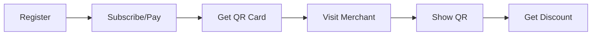
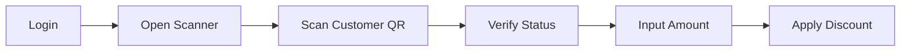

# 📄 Product Requirement Document (PRD)
## Project: Bali Discount Club (BDC) Web App (MVP 1)

| Attribute | Details |
| :--- | :--- |
| **Product** | Bali Discount Club (BDC) |
| **Version** | 0.1 (MVP Draft) |
| **Status** | 🟢 Active / Planning |
| **Prepared by** | Spinotek |
| **Date** | April 4, 2026 |

---

## 📑 Table of Contents
1. [Overview](#1-overview)
2. [Goals & Objectives](#2-goals--objectives)
3. [User Roles](#3-user-roles)
4. [Core Features (MVP Scope)](#4-core-features-mvp-scope)
5. [User Flows](#5-user-flow)
6. [Data & Analytics Strategy](#6-data--analytics-strategy)
7. [Technical Approach](#7-technical-approach)
8. [Risks, Considerations & Mitigation](#8-risks-considerations--mitigation)
9. [Future Roadmap (Post-MVP)](#9-future-roadmap-post-mvp)
10. [Success Metrics](#10-success-metrics)

---

## 1. 🧭 Overview
**Bali Discount Club (BDC)** is an exclusive digital membership platform designed to provide instant access to various offers and discounts at selected merchant networks across Bali (Restaurants, Spas, Cafes, Activities, etc.).

The platform is built as a **Progressive Web App (PWA)** to provide a native app experience without installation hurdles, ensuring fast and lightweight access for users on the move.

---

## 2. 🎯 Goals & Objectives

### 💼 Business Goals
*   **Membership Growth**: Acquisition and retention of active membership exclusively.
*   **Merchant Success**: Driving transaction volume and visits to partner merchants.
*   **Data Monetization**: Collecting precise customer behavior data for data-driven marketing strategies.

### 🚀 Product Goals (MVP 1)
*   **Market Validation**: Validating the digital membership business model in the Bali market.
*   **Usage Tracking**: Collecting initial usage data for product iteration.
*   **Operational Efficiency**: Admin dashboard for real-time monitoring.

---

## 3. 👥 User Roles

### 3.1 👤 Customer (End User)
*   **Target**: Expats, long-term tourists, and digital nomads in Bali.
*   **Core Needs**:
    *   Instant registration and payment process.
    *   Access to digital membership card (QR) in seconds.
    *   Clear visibility of benefits and savings achieved.

### 3.2 🏪 Merchant (Partner)
*   **Target**: Local businesses (Cafes, Restaurants, Spas, Gyms, Activity Providers).
*   **Core Needs**:
    *   Fast and accurate membership validation.
    *   Minimalist transaction input process (low friction).

### 3.3 🛠️ Super Admin (BDC Team)
*   **Core Needs**:
    *   Centralized management for merchant and user data.
    *   Analysis of user behavior for strategic decision-making.

---

## 4. 🔑 Core Features (MVP Scope)

### 4.1 Customer Features
*   **🔐 Authentication**:
    *   Instant Registration via **Google Login** (Primary) or Email.
    *   **Lifetime Persistent Session**: Users stay logged in indefinitely to ensure instant access to the digital card. No automatic logout; sessions expire only upon explicit manual logout by the user.
    *   Secure Login/Logout session management.
*   **💳 Subscription Engine**:
    *   Tiered Packages: 1 Month, 3 Months, 12 Months.
    *   Payment Gateway Integration (Stripe).
*   **🪪 Digital Membership Card**:
    *   Unique Dynamic QR Code.
    *   Display: Name, Member ID, Expiry Date.
*   **💰 Savings Tracker**:
    *   Personalized dashboard showing total savings.
    *   "You saved $120 this month" - Visual motivation element.
*   **📍 Merchant Directory (Basic)**:
    *   List of merchants by category and location.

### 4.2 Merchant Features
*   **📸 QR Scanner**: Browser-based scanner for real-time member validation.
*   **📝 Mandatory Transaction Log**:
    *   **Required Field**: Input of total transaction amount (Nominal).
    *   **Automatic Logic**: System applies a non-negotiable **10% discount**.
    *   **Data Audit**: Logging every successful scan with the final transaction value.
*   **✅ Instant Confirmation**: Visual and audible notification of valid member status.

### 4.3 Super Admin Features
*   **🏢 Merchant Management**: CRUD system for merchant data and content.
*   **📈 Dashboard Metrics**:
    *   Real-time monitoring: Total users, Active Members, Revenue.
    *   **Behavior Analytics**: Favorite categories, Most popular merchants, Visit frequency.

---

## 5. 🔄 User Flow

### 🌊 Customer Flow

### 🌊 Merchant Flow

---

## 6. 🧠 Data & Analytics Strategy (Core Value)

BDC is not just a discount platform, but a **behavior data engine** for future business optimization.

### Data Points:
1.  **Usage Index**: Frequency of use per user/per category.
2.  **Merchant Heatmap**: Which merchants are most effective at driving traffic.
3.  **High-Spender Segment**: Identifying users with large transaction amounts for loyalty/VIP programs.

### Actionable Insights:
*   *"Spa category low?* Run a campaign boosting F&B users to Spa."
*   *"User X often visits Cafes?* Send personalized offers for new coffee vendors."

---

## 7. 🏗️ Technical Approach

| Layer | Technology |
| :--- | :--- |
| **Frontend** | React / Next.js (PWA Optimized) |
| **Backend** | Laravel (Robust & Scalable API) |
| **Database** | MySQL (Core), MongoDB (Future Logging) |
| **Payment** | Stripe (Recommended for Expats) |
| **QR System** | Dynamic Tokenized QR (Anti-fraud) |

---

## 8. ⚠️ Risks, Considerations & Mitigation

| Risk | Description | Mitigation |
| :--- | :--- | :--- |
| **Operational** | Merchants forget/inconsistent in applying discounts. | Mandatory Merchant Training & Dashboard Monitoring. |
| **Fraud** | QR screenshot sharing between users. | Dynamic QR (auto-refresh) & Server-side validation. |
| **Technical** | Slow internet connection at merchant location. | Offline support (PWA) & API Latency optimization. |

---

## 9. 🚀 Future Roadmap (Post-MVP)
*   **Flash Deals**: Limited-time discounts (Happy Hour).
*   **Geo-Fencing**: Promo notifications when users are near partner merchants.
*   **AI Recommendations**: "Based on your visits, you might love this spa."
*   **Gamification**: Badges and reward levels for frequent users.

---

## 10. 📊 Success Metrics
*   **Conversion Rate**: % of landing page visitors becoming paid subscribers.
*   **Retention Rate**: % of users renewing their subscription.
*   **Merchant Engagement**: Average daily transactions per merchant.
*   **Total Community Savings**: Total discount value enjoyed by all members.